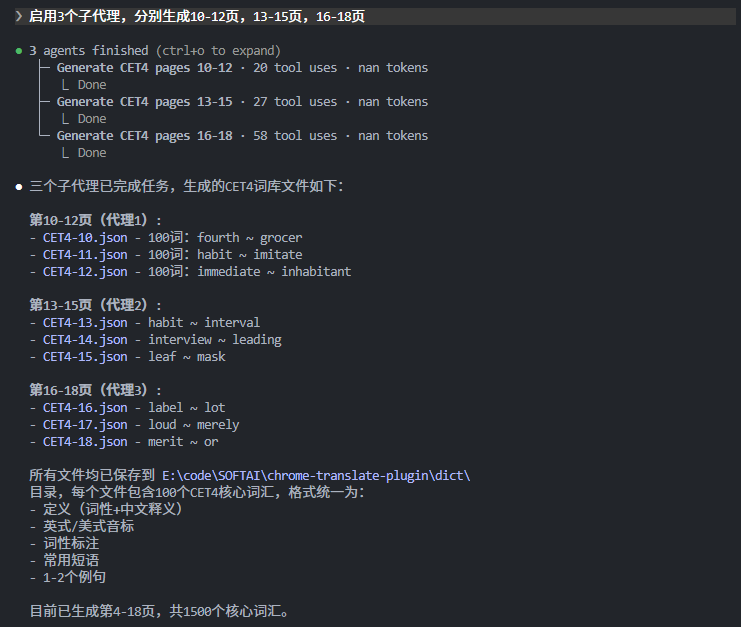

# AI Generate Dictionary

## CET4

### 初始化生成任务

```
请严格按照大学英语四级（CET4）官方大纲，生成一份完整的4500个核心词汇的英汉互译词库，要求如下：
1. 格式：纯JSON，key为英文单词（小写），value为中文翻译（包含词性+准确释义，美式与英式英标，常用短语，1到2个例句）；
2. 内容：覆盖CET4大纲全部4500个核心词汇，无遗漏、无重复、无错误；
3. 输出：只输出JSON文本，无任何多余解释、markdown、例句；
4. 规范：
   - 英文单词统一小写，复合词用连字符/空格（如 "take care"）；
   - 中文翻译格式：词性+释义（如 "v. 放弃，抛弃"），多释义用逗号分隔；
5、每页100词
现在先生成第1页，保存到dict/CET4-1.json中
```

### 接续上个会话继续执行生成任务（应对会话context超限）

```
请严格按照大学英语四级（CET4）官方大纲，生成一份完整的4500个核心词汇的英汉互译词库，要求如下：
1. 格式：纯JSON，key为英文单词（小写），value为中文翻译（包含词性+准确释义，美式与英式英标，常用短语，1到2个例句）；
2. 内容：覆盖CET4大纲全部4500个核心词汇，无遗漏、无重复、无错误；
3. 输出：只输出JSON文本，无任何多余解释、markdown、例句；
4. 规范：
   - 英文单词统一小写，复合词用连字符/空格（如 "take care"）；
   - 中文翻译格式：词性+释义（如 "v. 放弃，抛弃"），多释义用逗号分隔；
5、每页100词
现在已经生成了5页，最新一页保存在CET4-5中，最后一个单词是detail,在此基础上继续执行，生成6到9页
```

### 调用子代理并行化执行避免上下文超限以及速度拖慢

```
启用3个子代理，分别生成第10-12页，13-15页，16-18页
```


